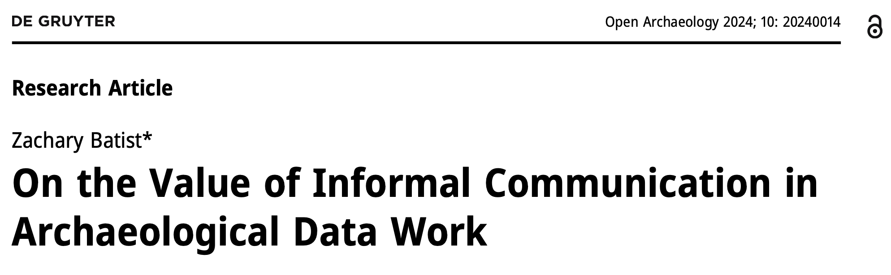
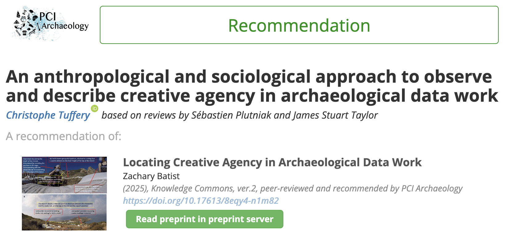
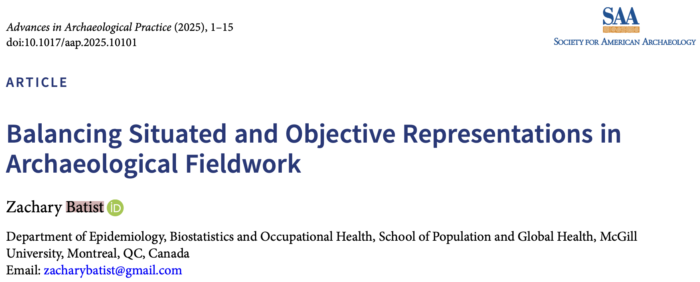
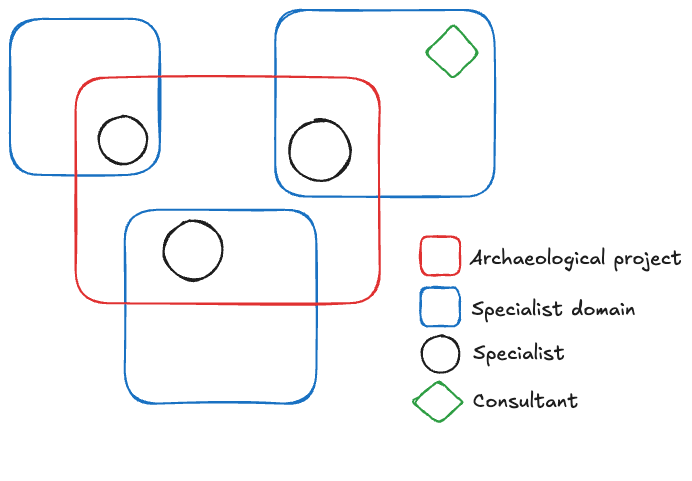

---
format:
  revealjs:
    slides: true
    output-file: slides
    embed-resources: true
    theme: black
    slide-number: c/t
    title: "Data Management is People Management:"
    subtitle: On Abstraction of Data and Labor in Archaeological Projects
    description: <a href="https://archaeo.social/@zackbatist">zackbatist@archaeo.social</a>
    date: 2025-12-03
    date-format: long
    toc-depth: 1
    toc-title: Overview
    # footer: |
    #   <a href="https://zackbatist.info/data-tech-poli-arch/">zackbatist.info/data-tech-poli-arch</a>
    template-partials:
      - ../assets/title-slide.html
    css: ../assets/slides-styles.css

---

# Background
::: {.notes}

- So when I talk about data, we should be clear about what we mean.
- This is true as researchers, as curators, and as scholars of scientific practice.
- So before I go further, I'll briefly discuss the notion of data and disentangle its multiple meanings.

- It turns out, that when researchers say the word "data", they mean a few different things.
- So I've identified three notions of data that are often conveyed:

:::

## Notions of data
1. Descriptive accounts of observed phenomenon
    - [e.g. data describes objects]{.small-text}

1. Evidence that forms the basis of a claim
    - [e.g. data grounds interpretations in reality]{.small-text}

1. Means of communicating observations from one set of circumstances to another
    - [e.g. data are published, integrated, analyzed or visualized]{.small-text}

::: {.notes}

- The first constitutes the observable sets of characteristics, properties or features pertaining to objects of interest
- The data is going to follow a data model that delimits what's relevant, and it will always paint an incomplete picture.
- For instance, this does not capture that Spencer always wears a bowtie collar, or that the unnamed feral tortie loves playing in the autumn leaves.

- The second notion presents data as the evidential basis upon which inferred claims are either verified or refuted

- And finally (and most interesting, in my opinion), the third notion presents data as records made about objects of interest, which are inscribed upon some medium, and can be consulted, accessed or used as stand-ins for the objects that they have been constructed to represent.

- In simpler terms, as means of communicating observations from one set of circumstances to another.
- This latter aspect of data tends to acknowledge the material circumstances under which data were collected, and therefore presents the data as outcomes of decisions and actions, rather than reflections of stable knowledge.
- This can be imagined as someone documenting their data collection protocols, the rationales behind those plans, and also the ways in which their actions deviated from their planned courses of action.

:::

## Implications

- Data are products of human decisions and actions
- Data are situated within organizational structures that scaffold coordinated action

# Methodology
## Approach
- Science and technology studies
  - Conceptualizes research as a social and collaborative enterprise
  - Emphasizes lived experience over system design perspective
- Case study
  - Articulates key factors shaping how archaeologists curate collective data streams
  - Prompts deeper thought on how we structure our work

## Cases
- [**Case A:**]{.underline} Long-term intervention (2016-2019), greater familiarity with actors and relationships
- [**Case B:**]{.underline} More intensive 10 day intervention (2019)

::: {.notes}
- Research projects directed by professors affiliated with North American universities

:::

## Data
- Observations
  - Examines what researchers do in practice rather than what they report or assume they do

- Interviews
  - Embedded inquiries as participants work, to explain the rationale behind their actions
  - Retrospective interviews concerning general attitudes and reflections

## Data

- Documents
  - Records created as work unfolded
  - Bear traces of their meaningfulness within a broader system of knowledge creation

- Field notes
  - Unrecorded observations and conversations
  - My own reflections

---

{.absolute top=0 left=-100 width=65%}
{.absolute top=250 left=-100 width=65%}
{.absolute top=150 left=600 width=50%}

::: {.notes}
Just for some context, this paper derives from my doctoral dissertation, which I defended in August 2023.
I've published three other related papers drawing from the same rich dataset.

:::

## Analysis
:::: {.columns .small-text}

::: {.column width="65%"}
::: {.fragment}
- Coding interview transcripts
  - Enables me to develop theory about social actions
:::

::: {.fragment}
- Writing analytic memos
  - To synthesize broader concepts, themes and theories based on the encoded data
:::

::: {.fragment}
- Informed by broader theoretical frameworks
  - About scientific practice, research infrastructure, collaborative experiences, information commons
:::

::: {.fragment}
- Theory is therefore "grounded" in the data
:::
:::

::: {.column width="35%"}

:::

::::

::: {.footer}
:::

# Findings

::: {.notes}

- To reiterate, this paper documents some ways in which projects scaffold archaeologists’ behaviours through technical and administrative means.
- It accomplishes this by identifying different kinds of agency that drive and carry out common archaeological tasks, and ascertains how these relationships are embedded within or affirmed by data management systems.

:::

## Finds processing
I'll start with the example of finds processing.

Archaeological projects uncover a lot of varied material, which must be sorted and processed to facilitate subsequent analysis.

In the cases I observed, finds processing began in the field, where objects were either kept aside or discarded into the spoil heap.

At both cases, fieldworkers divided these finds into broad-level categories corresponding to materials, such as ceramic, bone and shell, separating them into bags and buckets labelled with the excavation unit in which they were found, as they emerged from the trenches (see Figure 3: E and F) and Figure 2.
At the same time, they tossed stones that exhibit no anthropogenic qualities (see Figure 3: D).
They also used sieves to separate loose sediment from small objects, collecting those that they deem culturally meaningful, and discarded the rest (see Figure 3: A, B, C and D).

Excavators were usually able to detect what was worth keeping by eye, but operating sieve is an activity that does this task in isolation.

Additionally, there's the task of tagging and bagging the materials set aside during excavation.
In my observations, it was almost always the job of trench supervisors to write on or otherwise dictate these tags and bags, to render the haphazard bucketing into a more concrete and lasting official record.
This is not an injustice, but rather a testament to their familiarity with the flow of materials owing to their embedding within a broader site-wide system of knowledge production that trench assistants do not (yet) have access to.

At the same time, as fieldworkers, supervisors lacked access to other forms of specialized knowledge.
Fieldworkers were expected to classify finds on the basis of characteristics commonly recognized as more natural, while study of their anthropogenic qualities was typically reserved for finds analysis.

In effect, a distinction was made between fieldwork, which deals with materials, and finds analysis, which deals with artefacts and ecofacts.

Moreover, even when specialists worked in the field, they operated as fieldworkers; their actions were constrained by the practical circumstances of fieldwork and the position of fieldwork within a broader apparatus of archaeological knowledge production.

In this sense, the division of labour was partly due to pragmatic concerns, namely the fact that fieldworkers were usually occupied with their own specific tasks that required mental concentration, especially when instructed to do this work quickly.

So it's not about identify, but about pragmatic position within a system of knowledge production.

## Consultants

Another set of examples is concerned with being bound by the systems that enforce systematic modes of knowledge production.

All specialists are encouraged to do their work in a systematic manner.
They do this by embedding the materials within the domains they represent.
They therefore liaise their specialized knowledge to the project and their project's materials to the specialist domain.

At the same time, some projects call in consultants to help make sense of the materials _without holding them accountable to the project's structured guidelines_.

This is apparent in the example of Andreas...

And in the example of Denise...

## Sampling
- Tends to occur in service of some specialist domain.
- When a fieldworker is asked to help collect samples, they tend to do so as instruments of some other creative force.

# Discussion
- The constitution of archaeological data is as much a social phenomenon as it is a technical one.
- Positional within the system dictates how one may contribute.
- The project's boundaries are demarcated by the information systems they established to scaffold and structure the data it is mandated to collect and curate.
- Consultants may be called in to help guide how projects should tweak their processes and information management systems, but they themselves have no role in actually working within those systems.
- It is also notable that they consult with directors and leaders of independent leaders of specialist domains, i.e, those with greater creative agency.
- In other words, they advise the creative agents regarding how they should tweak their designed workflows.

